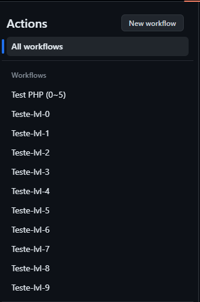
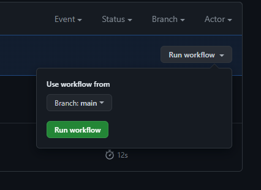
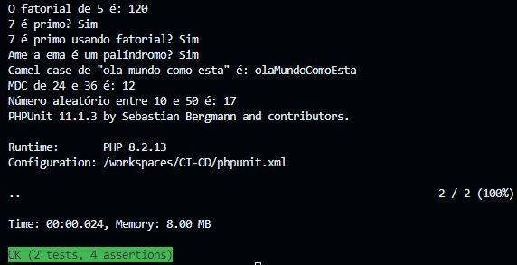

# Teste usando o PHP_Stan

Ao fazer um push, irá rodar um workflow que testará seu código com os níveis de 0 a 5.

E possível fazer testes isoladamente indo em **ACTIONS** no seu repositório.


Escolher o nível que deseja.



Run Workflow -> é possível selecionar branch -> Verde(Run Workflow)




## Nível 0:
- Existência e acessibilidade de classes
- Existência e acessibilidade de métodos e funções chamadas com $this
- Incompatibilidades de argumentos
- Incompatibilidades de tipos

## Nível 1:
- Variáveis possivelmente indefinidas
- Métodos mágicos desconhecidos e propriedades em classes com __call e __ge

## Nível 2:
- Métodos desconhecidos verificados em todas as expressões (não apenas $this)

## Nível 3:
- Tipos de retorno
- Tipos atribuídos a propriedades

## Nível 4:
- Verificação básica de código morto
- Verificações sempre falsas de instanceof e outros tipos
- Ramificações inacessíveis de else, código inacessível após return, etc.

## Nível 5:
- Checa os tipos de argumentos passados para os métodos e funções

## Nível 6:
- Reportar sugestões de tipos de variáveis

## Nível 7:
- Relata união de tipos erradas

## Nível 8:
- Relatar chamadas de métodos e acesso a propriedades com tipos null

## Nível 9:
- Restringe a utilização de tipos mistos

|------------------------||------------------------||------------------------||------------------------||-----------------|

# Teste usando o PHPUnit

### 1º Crier um arquivo dentro do diretório desejado:

Caso seja teste unitário:

    /test/unit

OBS: A estrutura a baixo deve ficar no topo do código de teste

```
<?php
require_once 'vendor/autoload.php';
require_once 'Caminho/para/codigo/';  #Inclui o arquivo a ser testado
require_once 'Caminho/para/codigo/';  #Inclui o arquivo a ser testado
...

use PHPUnit\Framework\TestCase;

<-- Suas funções -->
```

Caso seja teste de itens fakes

    /test/fake

OBS: A estrutura a baixo deve ficar no topo do código de teste

```
<?php
require_once 'vendor/autoload.php'; 
use Faker\Factory;
```

### 2º Após criar o arquivo de teste, use:

Para executar um teste específico:

    ./vendor/bin/phpunit tests/unit/Nome_do_arquivo_de_teste.php

    ./vendor/bin/phpunit tests/fake/Nome_do_arquivo_de_teste.php

Para executar o diretório completo de testes

    ./vendor/bin/phpunit --testsuite "unit"

    ./vendor/bin/phpunit --testsuite "fake"

Para executar o teste.

Se tudo de certo, vai aparecer uma tela parecida com essa;



- As primeiras linha são os resultados os testes
- ('''') A quantidade de teste feitos, Tempo e Memoria usada.
- O (OK) significa que deu tudo certo 
    - 2 testes realizados e 4 acertos

